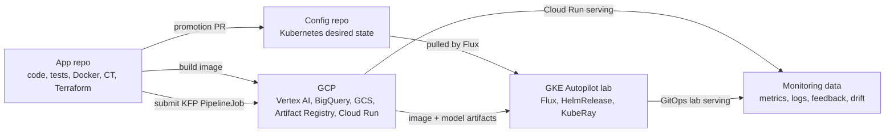
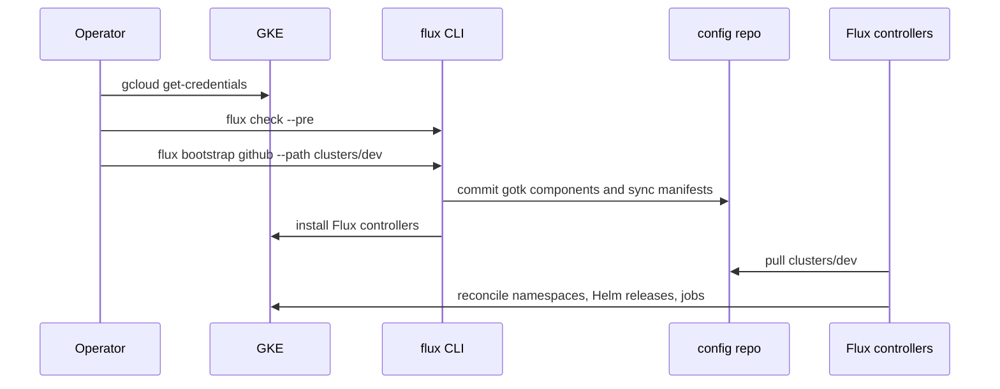
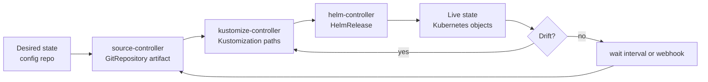
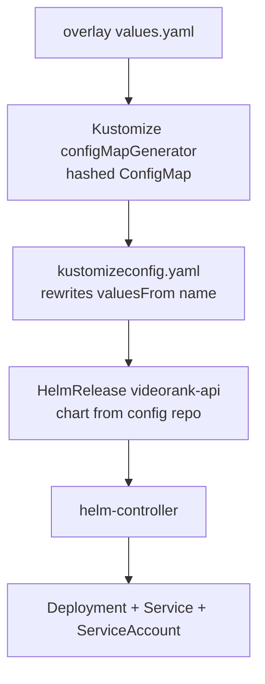
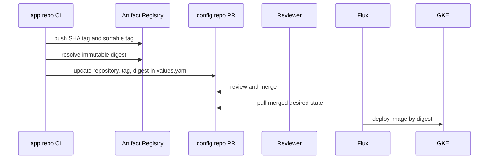
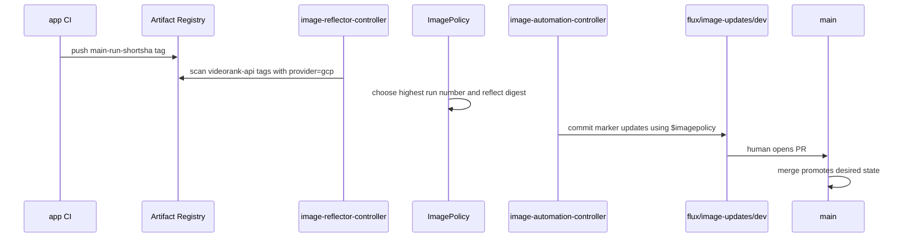
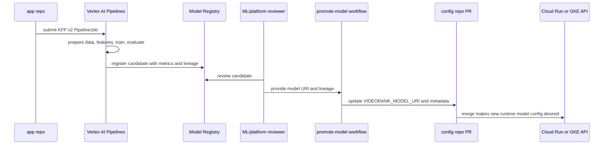
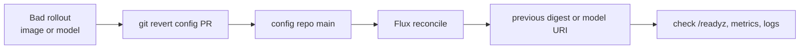

# VideoRank Architecture

## Executive Summary

VideoRank is a compact production-style MLOps system for video recommendation.
It demonstrates the platform concerns in the Dailymotion role: ML engineer
productivity, data access, CI/CD, GitOps, monitoring, production serving,
experimentation, and cost-aware cloud operations.

The project uses two repositories:

- `videorank-mlops-app`: source code, tests, pipelines, Terraform and CI.
- `videorank-mlops-config`: Kubernetes desired state reconciled by Flux.

The important interview point: CI produces artifacts; GitOps promotes and
reconciles runtime state. GitHub Actions does not mutate the cluster directly.

## 1. System Boundaries

This diagram is about ownership. The app repo creates artifacts and managed GCP
resources. The config repo owns Kubernetes runtime state. GCP hosts the managed
ML platform and permanent low-cost serving. GKE is an ephemeral lab used to
practice Flux, Helm and KubeRay.

## 2. Flux Bootstrap

Bootstrap is idempotent. The lab explicitly installs the optional
`image-reflector-controller` and `image-automation-controller` because image
automation CRDs are declared in the config repo.

## 3. Reconciliation Loop

Flux is a pull-based control loop: observe source, compare desired state to live
state, act, then repeat. Manual cluster changes are temporary diagnostics; the
durable fix is a Git change.

## 4. HelmRelease Mechanism

The chart is stored in Git because it is a small in-house chart. The
`HelmRelease` has explicit install retries, upgrade retries, rollback strategy
and timeout. The values `ConfigMap` keeps its hash so Flux sees config changes
cleanly.

## 5. Application Image Promotion

The sortable tag is for Flux image policy discovery. The digest is what pins the
exact artifact. This keeps the production answer simple: tags are selectors,
digests are deployment identity.

## 6. Flux Image Automation Lab

The automation does not push directly to `main`. It pushes to a staging branch
so image updates remain reviewable. In a real production setup, a bot or policy
engine can open the PR automatically, but the merge is still an auditable
promotion event.

## 7. Continuous Training And Model Promotion

Continuous Training creates a candidate. Promotion is a separate control with
review, lineage and rollback. The API can load a promoted `gs://` model artifact
without rebuilding the serving image.

## 8. Rollback

Rollback does not require rebuilding. Git history records both the bad
promotion and the rollback decision.

## Main Design Choices

Cloud Run is the permanent serving platform because it is stateless, low-ops,
scale-to-zero and enough for a portfolio API. GKE is still used in a short lab
because the role explicitly mentions Flux, Kubeflow/KubeRay and Kubernetes.
This is a cost-aware compromise: use Kubernetes where it teaches the target
concepts, not where it adds unnecessary operations.

BigQuery acts as the offline feature store and logging layer. Tables are
partitioned by timestamp and clustered by keys used in recommendation joins.
That supports cost control and lets us explain feature freshness, backfills,
model monitoring and user-level debugging.

The model keeps a popularity baseline. The baseline is not a toy; it is the
production fallback and the minimum bar a new model must beat.

## Failure Modes To Discuss

- Bad model promotion: revert the config repo model promotion PR.
- Bad image promotion: revert the config repo digest promotion PR.
- GCS model unavailable: API falls back to the embedded popularity catalog.
- BigQuery logging delayed: serving continues; logs are retried or buffered.
- Manual cluster drift: Flux reconciles the cluster back to Git.
- CI compromise: CI service account cannot read all runtime data because IAM is
  separated by purpose.
- Cost spike: budget alerts, GKE teardown, resource quotas and no GPU in the lab.

## Vertex AI / Kubeflow Continuous Training

The real-data training path is a Continuous Training loop. GitHub Actions
validates the Kubeflow Pipelines template on pull requests, then submits Vertex
AI `PipelineJob` runs from `main`, weekly schedule or manual dispatch. The
training run is parameterized with `data_snapshot_id`, `git_sha` and `run_id` so
model lineage is explainable.

The pipeline stages are:

1. Download and normalize MovieLens latest-small into VideoRank interaction
   events.
2. Register the snapshot as a Vertex AI managed Dataset.
3. Build user-level features, publish the BigQuery source table, and optionally
   create/update Vertex AI Feature Store online resources.
4. Train a CPU-only matrix factorization ranker with user and item embeddings.
5. Evaluate against popularity baseline with AUC, Brier, Recall@10 and NDCG@10.
6. Log parameters and metrics to Vertex AI Experiments.
7. Apply a quality gate, then upload the candidate to Vertex AI Model Registry.
8. Write final registration metadata linking Git, data, metrics and Vertex
   resources.

This keeps Kubernetes/Kubeflow semantics while avoiding self-hosting Kubeflow on
GKE for the interview lab. Vertex handles orchestration, metadata, artifact
storage, caching and retries; the project still owns data/model code and
promotion policy. CT registers a candidate model and metadata, but serving
promotion remains a separate review step. The `promote-model` workflow turns an
approved candidate into a config repo PR that pins `VIDEORANK_MODEL_URI` and the
related lineage fields.
