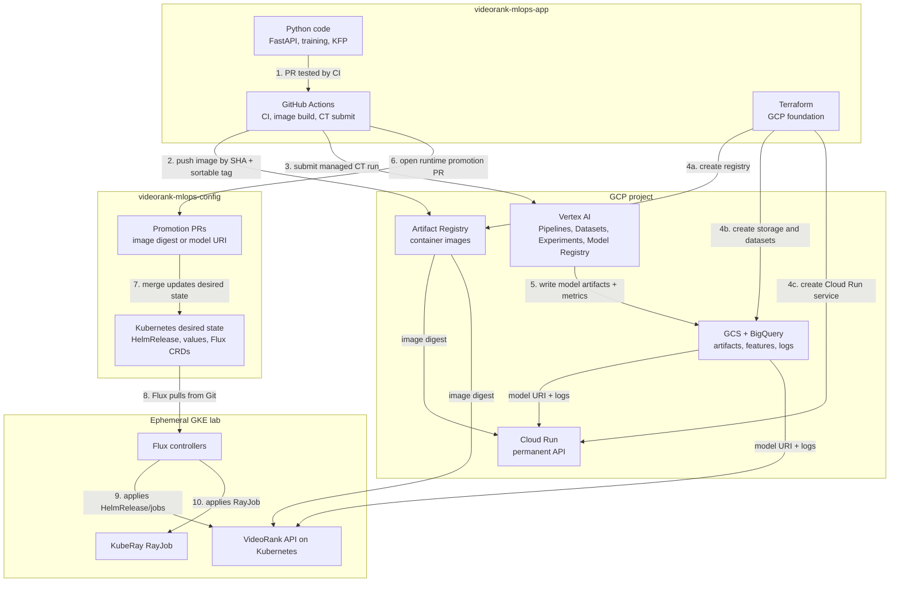
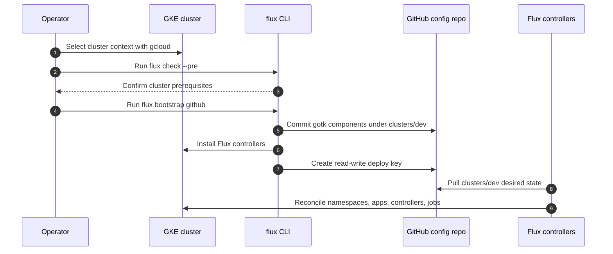
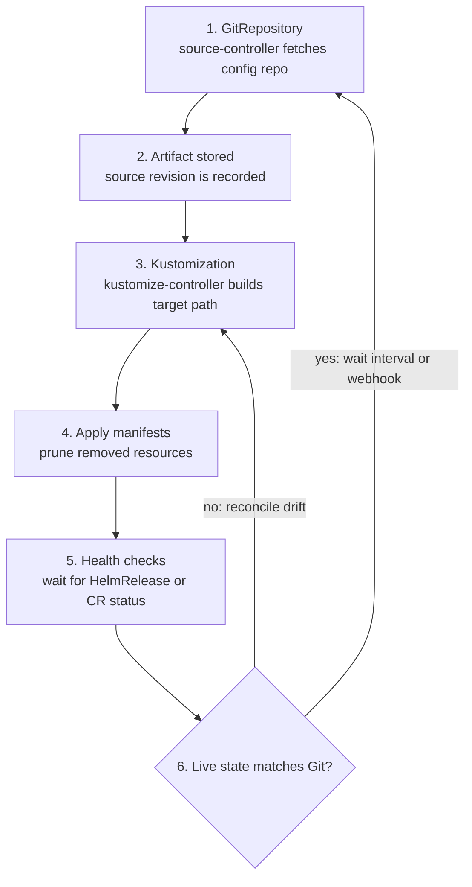
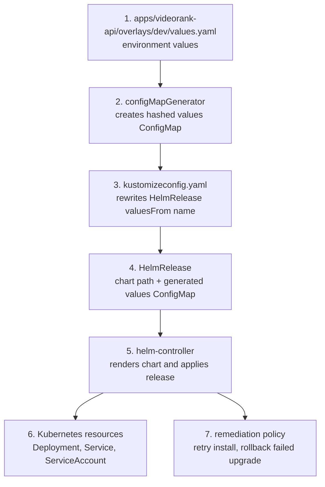
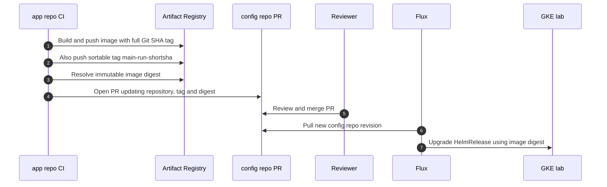
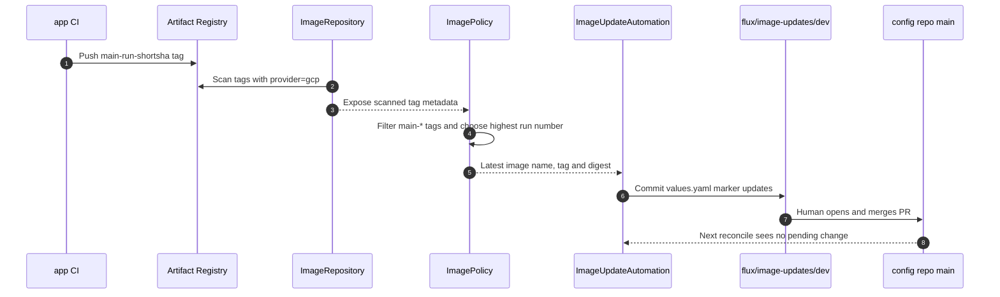
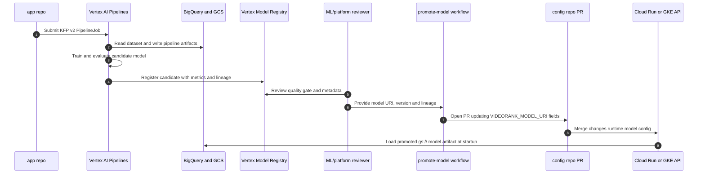
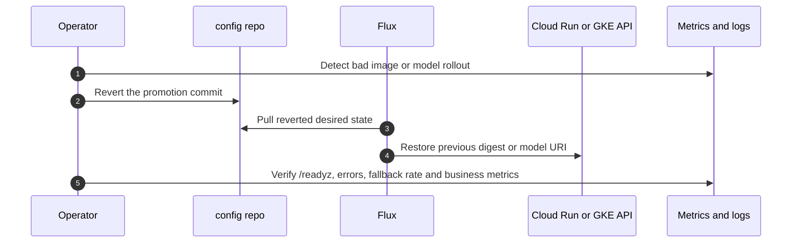

# VideoRank Architecture

## Executive Summary

VideoRank is a compact production-style MLOps system for video recommendation.
It demonstrates the platform concerns in the Dailymotion role: ML engineer
productivity, data access, CI/CD, GitOps, monitoring, production serving,
experimentation, and cost-aware cloud operations.

The project uses two repositories:

- `videorank-mlops-app`: source code, tests, pipelines, Terraform and CI.
- `videorank-mlops-config`: Kubernetes desired state reconciled by Flux.

The important interview point: CI produces artifacts; GitOps promotes and
reconciles runtime state. GitHub Actions does not mutate the cluster directly.

## 1. System Boundaries

Read it left to right by responsibility: the app repo produces artifacts, GCP
stores and runs managed services, the config repo declares Kubernetes runtime
state, and Flux applies that state inside the GKE lab.

## 2. Flux Bootstrap

Bootstrap is idempotent. `--components-extra` installs image automation
controllers, and `--read-write-key=true` is required because the image automation
lab pushes a staging branch back to Git.

## 3. Flux Reconciliation Loop

This is the core GitOps answer: Git is the desired state, Kubernetes is the live
state, and Flux repeatedly converges live state back to Git.

## 4. HelmRelease Mechanism

The values `ConfigMap` keeps its hash. That makes values changes visible as new
desired state while the custom Kustomize name reference keeps
`HelmRelease.spec.valuesFrom[].name` correct.

## 5. Application Image Promotion

The key interview phrase: tags help selection and traceability; the digest is
the immutable deployment identity.

## 6. Flux Image Automation Lab

This is intentionally not direct-to-main automation. Flux prepares an update
branch, but promotion remains a reviewed Git change.

## 7. Continuous Training And Model Promotion

Continuous Training creates a candidate. Promotion is a separate decision with
review, lineage and rollback. The serving image does not need to be rebuilt for
every model candidate.

## 8. Rollback

Rollback does not require rebuilding. Git history records both the bad
promotion and the rollback decision.

## Main Design Choices

Cloud Run is the permanent serving platform because it is stateless, low-ops,
scale-to-zero and enough for a portfolio API. GKE is still used in a short lab
because the role explicitly mentions Flux, Kubeflow/KubeRay and Kubernetes.
This is a cost-aware compromise: use Kubernetes where it teaches the target
concepts, not where it adds unnecessary operations.

BigQuery acts as the offline feature store and logging layer. Tables are
partitioned by timestamp and clustered by keys used in recommendation joins.
That supports cost control and lets us explain feature freshness, backfills,
model monitoring and user-level debugging.

The model keeps a popularity baseline. The baseline is not a toy; it is the
production fallback and the minimum bar a new model must beat.

## Failure Modes To Discuss

- Bad model promotion: revert the config repo model promotion PR.
- Bad image promotion: revert the config repo digest promotion PR.
- GCS model unavailable: API falls back to the embedded popularity catalog.
- BigQuery logging delayed: serving continues; logs are retried or buffered.
- Manual cluster drift: Flux reconciles the cluster back to Git.
- CI compromise: CI service account cannot read all runtime data because IAM is
  separated by purpose.
- Cost spike: budget alerts, GKE teardown, resource quotas and no GPU in the lab.

## Vertex AI / Kubeflow Continuous Training

The real-data training path is a Continuous Training loop. GitHub Actions
validates the Kubeflow Pipelines template on pull requests, then submits Vertex
AI `PipelineJob` runs from `main`, weekly schedule or manual dispatch. The
training run is parameterized with `data_snapshot_id`, `git_sha` and `run_id` so
model lineage is explainable.

The pipeline stages are:

1. Download and normalize MovieLens latest-small into VideoRank interaction
   events.
2. Register the snapshot as a Vertex AI managed Dataset.
3. Build user-level features, publish the BigQuery source table, and optionally
   create/update Vertex AI Feature Store online resources.
4. Train a CPU-only matrix factorization ranker with user and item embeddings.
5. Evaluate against popularity baseline with AUC, Brier, Recall@10 and NDCG@10.
6. Log parameters and metrics to Vertex AI Experiments.
7. Apply a quality gate, then upload the candidate to Vertex AI Model Registry.
8. Write final registration metadata linking Git, data, metrics and Vertex
   resources.

This keeps Kubernetes/Kubeflow semantics while avoiding self-hosting Kubeflow on
GKE for the interview lab. Vertex handles orchestration, metadata, artifact
storage, caching and retries; the project still owns data/model code and
promotion policy. CT registers a candidate model and metadata, but serving
promotion remains a separate review step. The `promote-model` workflow turns an
approved candidate into a config repo PR that pins `VIDEORANK_MODEL_URI` and the
related lineage fields.
