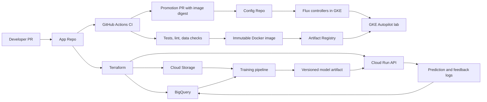

# VideoRank Architecture

## Executive Summary

VideoRank is a compact production-style MLOps system for video recommendation.
It demonstrates the platform concerns in the Dailymotion role: ML engineer
productivity, data access, CI/CD, GitOps, monitoring, production serving,
experimentation, and cost-aware cloud operations.

The project uses two repositories:

- `videorank-mlops-app`: source code, tests, pipelines, Terraform and CI.
- `videorank-mlops-config`: Kubernetes desired state reconciled by Flux.

The important interview point: CI produces artifacts; GitOps promotes and
reconciles runtime state. GitHub Actions does not mutate the cluster directly.

## System Diagram

## Main Design Choices

Cloud Run is the permanent serving platform because it is stateless,
low-ops, scale-to-zero and enough for a portfolio API. GKE is still used in a
short lab because the role explicitly mentions Flux, Kubeflow/KubeRay and
Kubernetes. This is a cost-aware compromise: use Kubernetes where it teaches
the target concepts, not where it adds unnecessary operations.

BigQuery acts as the offline feature store and logging layer. Tables are
partitioned by timestamp and clustered by keys used in recommendation joins.
That supports cost control and lets us explain feature freshness, backfills,
model monitoring and user-level debugging.

The model keeps a popularity baseline and a simple ranker. The baseline is not
a toy; it is the production fallback and the minimum bar a new model must beat.

## Failure Modes To Discuss

- Bad model promotion: revert the config repo digest or switch traffic to the
  baseline variant.
- GCS model unavailable: API falls back to the embedded popularity catalog.
- BigQuery logging delayed: serving continues; logs are retried or buffered.
- Manual cluster drift: Flux reconciles the cluster back to Git.
- CI compromise: CI service account cannot read all runtime data because IAM is
  separated by purpose.
- Cost spike: budget alerts, GKE teardown, resource quotas and no GPU in the lab.

