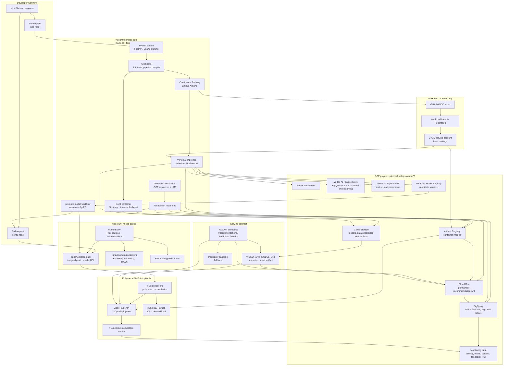

# VideoRank Architecture

## Executive Summary

VideoRank is a compact production-style MLOps system for video recommendation.
It demonstrates the platform concerns in the Dailymotion role: ML engineer
productivity, data access, CI/CD, GitOps, monitoring, production serving,
experimentation, and cost-aware cloud operations.

The project uses two repositories:

- `videorank-mlops-app`: source code, tests, pipelines, Terraform and CI.
- `videorank-mlops-config`: Kubernetes desired state reconciled by Flux.

The important interview point: CI produces artifacts; GitOps promotes and
reconciles runtime state. GitHub Actions does not mutate the cluster directly.

## General Architecture Diagram

The diagram is intentionally split by ownership boundary. The app repository
builds and validates artifacts. GCP hosts the data, training and serving
platforms. The config repository declares runtime state for Kubernetes, and Flux
keeps the GKE lab aligned with that state. Model promotion is a reviewable PR
that changes the model URI and lineage fields instead of rebuilding the serving
image.

## Main Design Choices

Cloud Run is the permanent serving platform because it is stateless,
low-ops, scale-to-zero and enough for a portfolio API. GKE is still used in a
short lab because the role explicitly mentions Flux, Kubeflow/KubeRay and
Kubernetes. This is a cost-aware compromise: use Kubernetes where it teaches
the target concepts, not where it adds unnecessary operations.

BigQuery acts as the offline feature store and logging layer. Tables are
partitioned by timestamp and clustered by keys used in recommendation joins.
That supports cost control and lets us explain feature freshness, backfills,
model monitoring and user-level debugging.

The model keeps a popularity baseline and a simple ranker. The baseline is not
a toy; it is the production fallback and the minimum bar a new model must beat.

## Failure Modes To Discuss

- Bad model promotion: revert the config repo digest or switch traffic to the
  baseline variant.
- GCS model unavailable: API falls back to the embedded popularity catalog.
- BigQuery logging delayed: serving continues; logs are retried or buffered.
- Manual cluster drift: Flux reconciles the cluster back to Git.
- CI compromise: CI service account cannot read all runtime data because IAM is
  separated by purpose.
- Cost spike: budget alerts, GKE teardown, resource quotas and no GPU in the lab.

## Vertex AI / Kubeflow Continuous Training

The real-data training path is a Continuous Training loop. GitHub Actions
validates the Kubeflow Pipelines template on pull requests, then submits Vertex
AI `PipelineJob` runs from `main`, weekly schedule or manual dispatch. The
training run is parameterized with `data_snapshot_id`, `git_sha` and `run_id` so
model lineage is explainable.

The pipeline stages are:

1. Download and normalize MovieLens latest-small into VideoRank interaction
   events.
2. Register the snapshot as a Vertex AI managed Dataset.
3. Build user-level features, publish the BigQuery source table, and optionally
   create/update Vertex AI Feature Store online resources.
4. Train a CPU-only matrix factorization ranker with user and item embeddings.
5. Evaluate against popularity baseline with AUC, Brier, Recall@10 and NDCG@10.
6. Log parameters and metrics to Vertex AI Experiments.
7. Apply a quality gate, then upload the candidate to Vertex AI Model Registry.
8. Write final registration metadata linking Git, data, metrics and Vertex
   resources.

This keeps Kubernetes/Kubeflow semantics while avoiding self-hosting Kubeflow on
GKE for the interview lab. Vertex handles orchestration, metadata, artifact
storage, caching and retries; the project still owns data/model code and
promotion policy. CT registers a candidate model and metadata, but serving
promotion remains a separate review step. The `promote-model` workflow turns an
approved candidate into a config repo PR that pins `VIDEORANK_MODEL_URI` and the
related lineage fields.
