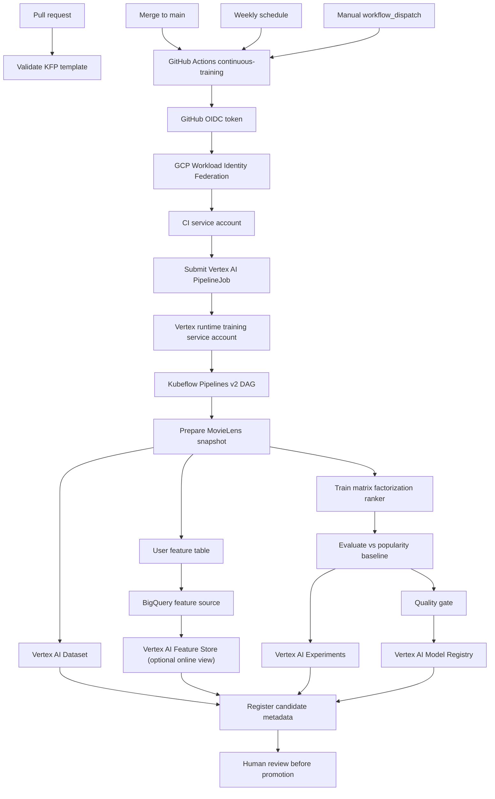

# Continuous Training With Vertex AI And Kubeflow

## Goal

Continuous Training is the automated retraining loop for ML models. In this
project it is deliberately separate from CI and CD:

- CI proves that code and the Kubeflow Pipelines template are valid.
- CT trains and evaluates a candidate model on Vertex AI Pipelines.
- CD promotes serving artifacts only after review and explicit promotion.

That separation is the main interview point. A successful training run should
not silently replace a production model.

## Flow



## Implementation

The GitHub Actions workflow is `.github/workflows/vertex-pipeline.yml`, displayed
as `continuous-training` in GitHub.

PR behavior:

- install `.[dev,ml,pipelines]`;
- run `ruff`;
- run the MovieLens/KFP tests;
- compile the Kubeflow Pipelines v2 YAML;
- upload the compiled YAML as a workflow artifact.

Main, schedule and manual behavior:

- authenticate to GCP with GitHub OIDC and Workload Identity Federation;
- compile the KFP template from the checked-out Git commit;
- submit a Vertex AI `PipelineJob`;
- run the job as `videorank-training`, not as the CI service account;
- pass traceability parameters: `data_snapshot_id`, `git_sha`, `run_id`;
- create a Vertex AI managed Dataset for the training snapshot;
- publish user features to BigQuery as the Feature Store source table;
- optionally create/update a Vertex AI Feature Online Store and Feature View;
- log metrics and parameters to Vertex AI Experiments;
- upload the gated candidate to Vertex AI Model Registry;
- attach Vertex labels: app, environment, workflow, trigger, Git SHA and GitHub run id.

The Vertex pipeline is `pipelines/kfp/pipeline.py`. Its stages are:

1. `prepare_movielens_events`: download and normalize MovieLens latest-small.
2. `register_vertex_dataset`: catalog the training snapshot as a Vertex AI
   Tabular Dataset.
3. `build_feature_table`: compute user-level features for recommendation.
4. `publish_vertex_feature_store`: load the feature source table to BigQuery and
   optionally create/update Feature Store online resources.
5. `train_matrix_factorization`: train a CPU-only recommender with embeddings.
6. `evaluate_ranker`: compute AUC, Brier, Recall@10 and NDCG@10.
7. `log_vertex_experiment`: log parameters and metrics in Vertex AI Experiments.
8. `quality_gate`: fail the pipeline if thresholds are not met.
9. `register_vertex_model`: upload the gated model candidate to Model Registry.
10. `register_model_metadata`: write model URI, metrics, data snapshot, Git
    metadata and Vertex resource names.

## Why This Is A Best-Practice CT Shape

- No JSON key: GitHub uses OIDC/WIF for short-lived credentials.
- Least privilege: CI submits the job; the Vertex runtime service account reads
  data/artifacts and writes training outputs.
- Review boundary: CT registers a candidate, but does not auto-promote serving.
- Reproducibility: model metadata links model URI, Git SHA, GitHub run id,
  dataset snapshot and metrics.
- Cost control: CPU-only MovieLens latest-small, lifecycle-managed GCS bucket,
  no Vertex Endpoint in this lab. Feature Store online resources are opt-in.
- Cache correctness: Vertex caching is enabled, but `data_snapshot_id` is an
  explicit pipeline input so a new data snapshot can invalidate cached steps.
- KFP artifact correctness: component outputs are written inside artifact
  directories, for example `events.jsonl` under the `Dataset` artifact path, so
  downstream Vertex tasks can materialize and read them reliably.
- Operational safety: GitHub concurrency avoids overlapping dev CT runs.

## Commands

Compile locally:

```bash
python -m pip install -e ".[dev,ml,pipelines]"
python pipelines/kfp/pipeline.py --output artifacts/pipelines/videorank_movielens_training.yaml
```

Submit locally:

```bash
PROJECT_ID=videorank-mlops-werpo78
REGION=europe-west1
PIPELINE_ROOT=gs://${PROJECT_ID}-videorank-artifacts/vertex-pipelines
TRAINING_SA=videorank-training@${PROJECT_ID}.iam.gserviceaccount.com

python pipelines/kfp/submit_vertex.py \
  --project-id "$PROJECT_ID" \
  --region "$REGION" \
  --pipeline-root "$PIPELINE_ROOT" \
  --service-account "$TRAINING_SA" \
  --data-snapshot-id "movielens-latest-small-$(date -u +%Y-%m-%d)" \
  --git-sha "$(git rev-parse HEAD)" \
  --run-id "local-$(date -u +%Y%m%d%H%M%S)" \
  --enable-vertex-datasets true \
  --enable-vertex-experiments true \
  --enable-vertex-model-registry true \
  --enable-vertex-feature-store false \
  --label app=videorank \
  --label env=dev \
  --label workflow=continuous_training \
  --label trigger=local
```

Trigger from GitHub:

```bash
gh workflow run vertex-pipeline.yml \
  --repo werpo78/videorank-mlops-app \
  -f sync=false \
  -f max_ratings=25000 \
  -f factors=24 \
  -f epochs=8 \
  -f min_model_ndcg_at_10=0.05 \
  -f min_ndcg_lift=-0.02 \
  -f enable_vertex_datasets=true \
  -f enable_vertex_experiments=true \
  -f enable_vertex_model_registry=true \
  -f enable_vertex_feature_store=false
```

## Interview Q/A

Q: What is Continuous Training?

A: Continuous Training is the automated retraining and validation loop for ML
models. It is triggered by code changes, data changes, a schedule or a manual
operation. It produces a model candidate with metrics and lineage; it should not
blindly replace production.

Q: Why use Vertex AI Pipelines for CT?

A: Vertex AI Pipelines runs Kubeflow Pipelines as a managed service. We keep KFP
concepts: components, artifacts, metadata, caching and retries, while avoiding
self-hosted Kubeflow operations for this lab.

Q: Why use Vertex AI Datasets here?

A: The managed Dataset catalogs the exact training snapshot. It gives a Vertex
resource for lineage and discoverability instead of hiding data behind an
opaque GCS path.

Q: Why use Vertex AI Feature Store here?

A: The pipeline computes user-level features and publishes them to BigQuery,
which is the source for Vertex AI Feature Store latest. The online Feature Store
resources are opt-in because an online store can create persistent cost.

Q: Why use Vertex AI Experiments?

A: Experiments keep parameters and metrics comparable across CT runs. That is
where an ML engineer can answer which data snapshot, hyperparameters and code
SHA produced a metric.

Q: Why use Vertex AI Model Registry if serving is Cloud Run?

A: Model Registry is the model control plane: candidate artifact, metadata,
container URI and lineage. Serving can still be Cloud Run; registry does not
force Vertex Endpoint deployment.

Q: Why not use Flux for Vertex AI training?

A: Flux reconciles Kubernetes resources. Vertex AI PipelineJob is a managed GCP
resource submitted through the Vertex API. GitHub Actions is the right actor
here because it owns source validation and can authenticate to GCP with OIDC.

Q: What prevents a bad model from reaching production?

A: Offline metrics are compared with a popularity baseline, the quality gate can
fail the pipeline, and the registration step records a candidate only. Serving
promotion remains an explicit review/promotion step.

Q: Why pass `data_snapshot_id`?

A: It captures which data snapshot was used and makes caching safe. Without a
data snapshot parameter, a scheduled CT run could accidentally reuse cached
outputs while the underlying data changed.

Q: Why write files inside KFP artifact directories?

A: Vertex/KFP artifacts are passed by artifact URI/path, and those paths behave
like artifact directories. Writing `events.jsonl` or `metrics.json` inside the
artifact path is more robust than treating the artifact path itself as a plain
file.

Q: Why separate CI service account and training service account?

A: The CI account needs permission to submit jobs. The training account needs
data/artifact permissions at runtime. Splitting them limits blast radius and
makes audit logs easier to interpret.

Q: Why is the GitHub CT default `max_ratings=25000`?

A: It is a cost guardrail for the lab. It still uses real MovieLens interactions,
but keeps Vertex runs short. Manual dispatch can set `max_ratings=100000` for the
full latest-small dataset or `0` for all available rows.

Q: What would change in production?

A: Use a versioned custom training container, store features in BigQuery or a
feature store with point-in-time guarantees, register approved models in Vertex
Model Registry, notify owners on failure, and promote through a controlled
canary or A/B process.
